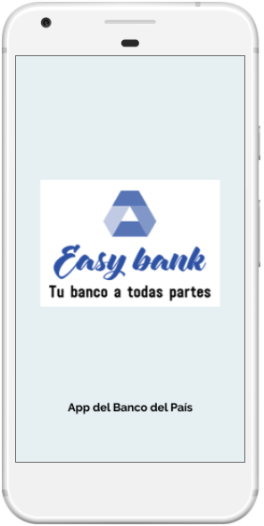
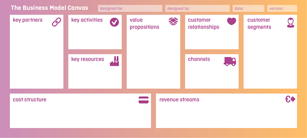

#   EASY BANK
Es una app que te permite realizar operaciones bancarias rápidamente,
configurando previamente através de un planificador y recibiendo
notificaciones para confirmar las operaciones.



## Proyecto desarrollado en [Laboratoria](http://laboratoria.la)

## En  [Peru](http://peru.com)

# Preliminares

## Banca Digital "El País"

### Descripción:

El Banco del País es uno de los bancos más importante de tu país. Es una institución de muchos años y actualmente está pasando por un proceso de transformación digital. Como parte de este proceso, han implementado un área de innovación que quiere llegar de una mejor manera a los usuarios más jóvenes.

Para ello se han propuesto **crear un banco 100% digital** dirigido para **Millenials**, inspirados en:

- **Nequi**. (https://www.nequi.com/)
- **Nubank**. (https://www.nubank.com.br/)
- **Simple**. (https://www.simple.com/)

### El Reto Nro 01
#### 🚩 Tabla de contenido
- [ORGANIZACIÓN PREVIA](#organización-previa)
- [INVESTIGACIÓN PREVIA](#investigación-previa)
- [MODELO DE NEGOCIO](#modelo-de-negocio)
- [STAKEHOLDERS](#stakeholders)
- [PLAN RESEARCH](#plan-research)
- [CRONOGRAMA DE ACTIVIDADES](#cronograma-de-actividades)
- [KICK OFF](#kick-off)

#### ORGANIZACIÓN PREVIA


#### INVESTIGACIÓN PREVIA
| Investigación | Descripción | Documentación  |
| ----          | ----        | ----           |
| **Aspectos de investigación -Versión-Excel** | Se buscó en internet y se realizó una lluvia de ideas| https://drive.google.com/open?id=1h0wBXJtuMqUMXP3tXyXKam3fD3MnrchRH1S0k8cSOjk|

#### MODELO DE NEGOCIO



| Modelo de Negocio | Descripción | Documentación  |
| ----          | ----        | ----           |
| **Banco Easy Bank 100% Digital Propuesto** | Se basó en las mejores prácticas de banca digital|https://github.com/PaoSil/Banca-Digital-/blob/master/assets/CANVAS%20-%20BANCA%20DIGITAL.png |
| **Banco Easy Bank** | Esta actualización se basa en los resultados de la investigación realizada| https://canvanizer.com/canvas/wS2ORNJ0yCUTP|


#### STAKEHOLDERS:


| Stakeholders | Descripción | Tipo |Rol |
| :----------- | :---------: | :---------: | :----------: |
| SBS          | Entidad reguladora | Externo |Regulador |
| BCR          | Entidad reguladora | Externo |Regulador |
| Millenials | Clientes | Externo | Usuarios Externos | |
| Ejecutivo de Call Center | Proveedores | Externo | Soporte Cliente | |
| Inversionistas | Accionistas | Externo - Interno |Patrocinador |
| Dueño del Banco País | Empleado | Interno |Toma de decisiones |
| CEO | Cofundador | Interno |Cofundador |
| Gerente de Operaciones | Cofundador | Interno | Estrategia Operaciones | |
| Gerente de Innovacion | Empleados | Interno | Estrategia Competitiva | |
| Product Manager | Empleados | Interno | Estrategia del Producto| |
| Front-End | Empleados | Interno | Desarrollo de Maquetación | |
| Back- End | Empleados | Interno | Desarrollo de Plataforma | |
| Gerente de Soporte y Redes |Empleados | Interno | Mantenimiento Plataforma | |
| Gerente de Marketing |Empleados | Interno | Estrategia Comercial | |

##### Aspectos importantes propuestos por los Stakeholders , para la propuesta de valor al cliente.
* **Diferenciación**
* **Accesible**
* **Interactivo con el Usuario**
* **Romper con los esquemas de los bancos tradicionales**
* **Fácil uso**
* **Disminución de reclamos**
* **Atención las 24 horas**

### PLAN RESEARCH:


```sh
| Objetivos                                                                                              |
| :----------------------------------------------------------------------------------------------------: |
* Planear : la Investigacion cuantitativa y cualitativa.
* Reclutar : personas que cumplan el perfil idoneo para validar supuestos.
* Conducir : la investigacion de la problematica y expectativas de los clientes.
* Analizar : supuestos y validaciones.
* Reportar : conclusiones y feedback.

| Alcance                                                                                                |
| :----------------------------------------------------------------------------------------------------: |
* Propuesta : baja utilizacion de operacionesbancarias online.
* Propuesta de Modelo de Negocio : Banca digital.
* Propuesta de Proyecto : **EASY BANK** - Asistente inteligente de Banca digital online.
* Linea de tiempo del proyecto : 1 semana y media.
* Quienes son los usuarios : Millenials.

|Metodologia                                                                                             |
| :----------------------------------------------------------------------------------------------------: |
* Revision de fuentes externas:
  - Recopilación y Conclusiones de Investigaciones de servicios ya existentes.
  - Información de los servicios de la competencia.
  - Documentos legales relacionados.
* Entrevistas:
  - Lista de Perfiles a quienes evaluar.
  - Guía de Entrevistas.
  - Modelos de Entrevistas.

|Actividades                                                                                             |
| :----------------------------------------------------------------------------------------------------: |
* Cronograma de actividades y duracion.

|Estrategia                                                                                              |
| :----------------------------------------------------------------------------------------------------: |
* Limitaciones de economia:
  - Reclutar personas conocidas (amistades, familiares, personas cercanas al lugar de trabajo).
  - No se le dará un regalo por la entrevista a las personas conocidas.
* Limitaciones de ubicación:
  - Se tiene acccesibilidad de distancia a agencias de banco para entrevistar ( Bcp / Bbva ).
  - Entrevista vía skype.
  - Encuestas vía form google.
* Limitaciones de confianza:
  - Reclutar personas conocidas (amistades, familiares ).
  - Reclutar nro de personas mínimas no conocidas cercanas al lugar de trabajo.
* Limitaciones de tiempo:
  - Recabar información ya existente de investigaciones de usabilidad, perfiles, negocio, etc.
  - Personas reclutadas que cumplen el perfil analizado.
  - Entrevistas realizadas en horario noche.
  - Entrevistas realizadas en días de fin de semana.

```

#### Cronograma de Actividades:

| Organización | Descripción | Documentación  |
| ----         | ----        | ----           |
| **Actividades -Versión-Excel** | Se establecieron actividades de equipo| https://drive.google.com/open?id=17GFjk4fBbsan2_g4y1MJu7nC038aplgCa8I5V8H0RqM|
| **Actividades - Versión-gráfico-trello** | Se establecieron actividades de equipo| https://github.com/PaoSil/Banca-Digital-/blob/master/assets/cronograma%20de%20actividades.png|


### KICK OFF MEETING:


**Descripción del Proyecto**

| Nombre del proyecto | Lugar de Reunion | Dueño del Proyecto | Fecha y hora |
| :-----------------: | :--------------: | :----------------: | :----------: |
| Banca Digital Easy Bank - "El Pais" | Banco "El Pais" | Paola Huaman - Yenny Quiñones | 25/02/2018 |

**Invitados del Proyecto**

| Invitados | Rol del proyecto |
| :-------: | :--------------: | 			
|CEO	|	Cofundador	|
|Gerente de operaciones de agencia |		Cofundador	|
|Product Manager	|	Empleado	|
|Front-end	|	Empleado	|
|Back-end	|	Empleado	|
|Gerente de Soporte y Redes	|	Empleado	|
|Ejecutivo de call center	|	Proveedor	|
|Gerente de innovacion	|	Empleado	|
|Gerente de Marketing	|	Empleado	|

**Documentación de actividad**

| Actividad | Descripción | Documentación |
| :-----------------: | :--------------: |  :--------------: | 
| Reunión Kick Off | Con el objetivo de presentar el Plan Research y hacer entrevistas que resulten en mejorar la investigación a realizar | https://drive.google.com/open?id=1bhBngESqolYa8YkM7AN0ereXnvWvZtrT0Hmae8Y-ejc |


### El Reto Nro 02:
#### 🚩 Tabla de contenido
- [PROCESO RESEARCH](#-proceso-research)
  - [Cuantitativo](#cuantitativo)
    - [Recopilación Data](#recopilación-data)
    - [Benchmarck](#benchmarck)
    - [Conclusiones 1](#conclusiones-1) 
  - [Cualitativo](#cualitativo)
    - [Entrevistas Presenciales](#-entrevistas-presenciales)
    - [Conclusiones 2](#conclusiones-2)
    - [Encuestas Online](#-encuestas-online)
    - [Conclusiones 3](#conclusiones-3)  
  - [Conclusiones 4](#conclusiones-4)

- [PROTOTIPO](#-prototipo)
  - [Papel](#papel)
  - [Figma](#figma)
  - [Figma](#marvel) 

- [TESTING](#-testing)


#### 📜 PROCESO RESEARCH:

En este proceso, conoceremos el contexto de la transformación digital en el banco. En tal sentido 
investigaremos a clientes ( milenialas) , el negocio de banco, las mejores prácticas y soluciones que
ya existen en el mundo y en el pais.

- El lado del cliente

  

- El lado del banco

 


- La relación cliente-banco

 


| Cuantitativo                                                                                           |
| :----------------------------------------------------------------------------------------------------: |

* **Revision de fuentes externas:**


| Actividad  | Descripción | Documentación  |
| ----       | ----        | ----           |
| **Análisis de Perfil Milenial** | Se recopiló información de fuentes externas| https://drive.google.com/open?id=15FREuVgbHBYK1ICdjqOd4-NUORzasyugRaNBaWemmTA |


* **Información de los servicios de la competencia ( Benchmark)**

| Actividad  | Descripción | Documentación  |
| ----       | ----        | ----           |
| **Revisión de Banca Local** | Se recopiló información de fuentes externas | https://drive.google.com/open?id=17HY1Dj5HjIed0lpM-kvcn-rYLgyLp4mr |
| **Revisión de Banca Internacional** | Se recopiló información de fuentes externas | https://drive.google.com/open?id=13MRdkhcngVuIswvNDnIQLjTmanbg5IeM |
| **Análisis de la competencia** | Se obtuvo las siguientes conclusiones| https://drive.google.com/open?id=1nSEVeSe8hDfcEyLnD0IA0qssF6UlufWatdAkQ7c-7Wg |


#### Conclusiones 1

A nivel Local

```sh
- Malos canales de atención de reclamos
- Estrategia de recomendación con retribución económica para la descarga y uso de app
- Bbva y Bcp utilizan colores fuertes y muy distintivos del banco de respaldo
- Interbank tiene un diseño de interacción ligero y más intuitivo y menos recargado, un buen referente.
- Distintas formas de navegar en menus y submenus tediosos
- Contiene las principales operaciones frecuentes de clientes, más no todas
- Problemas técnicos con la disponibilidad de la plataforma movil.
```

A nivel Internacional

```sh
- Posibilidad de solicitar tarjeta de cuenta ahorro por banca online y banca movil 
- Personalización en el diseño de tarjeta solicitada
- Diseño de vistas interactivas ligeras de color y texto 
- Diseño intuitivo
- Navegación fácil.
```

Cualitativo                                                                                             |
| :---------------------------------------------------------------------------------------------------: |


#### 💾 Entrevistas Presenciales

Se elaboraron guias de entrevistas, tomando en cuenta el Plan Research previamente definido.

|Actividad      | Descripción | Documentación  |
| ----          | ----      | ----           |
| Elaboración de guias de entrevistas vs-01 | Según Plan Research  | https://drive.google.com/open?id=1rOEyyb45DPdhmGBpcZbBEgD91lZECB5vZA5ojatrl38  |
| Elaboración de guias de entrevistas vs-02  | Según resultados de research cuantitativo     | https://drive.google.com/open?id=1ChXH_gEtNoIzg3aAi3GHz5PqCnapBHc8 |


| Entrevistados  | Descripción | Documentación  |
| ----           | ----        | ----           |
| **Contexto Milenials** | Se observó la utilización de la banca online a una persona| https://drive.google.com/open?id=1QeA6FEg_6cdVH-MOIHRPIRsph81RmBi1_gYcqzByBoM       |
| **Clientes Milenials**  | Se mejoraron las preguntas, se tienen 2 versiones, se entrevistaron a 9 milenials  | https://drive.google.com/open?id=1QeA6FEg_6cdVH-MOIHRPIRsph81RmBi1_gYcqzByBoM       |
| **Stakeholders** | Se realizaron 4 entrevistas : CEO - Gerente de Operaciones - Product Manager  | https://drive.google.com/open?id=1mfBrjTp-LcUiF0Sdc4oY_IDgfnPlKijsuLT3EPyXjQE  |

#### Conclusiones 2

```sh
- Uso de servicios bancarios para manejar volúmenes grandes de dinero
- Tienen poco tiempo disponible
- Los Milenials realizan muchas actividades
- Desagrado por las notificaciones de venta de productos de créditos
- Lo que más utilizan es las operaciones de transferencia
- Dificultad para realizar las transferencias interbancarias entre diferentes bancos
- Dificultad para realizar las transferencias internacionales
- Van al banco presencialmente para asegurar que realizarán la operación
- No tienen mucho tiempo para dar seguimiento a reclamos
```


#### 🌏 Encuestas Online

| Encuestados       | Descripción  |
| ----              | ----         |
| * **Milenials** | Se encuestaron a 19 milenials  |
|Preguntas: | https://drive.google.com/open?id=1H1Dpg38wTcBQ0-Ekwco0b5edy9ma_gh6mZ4aM6qp7ws |
|Formulario Google | <https://goo.gl/forms/x3nVF6e0PllB8XYj2>  |

#### Conclusiones 3

```sh
- Para elegir un banco: buena atención, comisiones bajas, beneficios y buena información.
- La decisión para abrir una cuenta es para compras, ordenar y administrar el dinero,
  y para recibir el sueldo .
- La decisión de cambio de banco es por motivos de: excesivos cobros a la cuenta ,
  irregularidades en el estado de cuenta y ofrecimiento de más operaciones gratuitas por otro banco.
- La gran mayoría ya cuentan con una cuenta visa y/o mastercard
- Importancia en abrir una cuenta de banco
- Percepción de engorroso con respecto al del trámite de abrir una cuenta
- Probarían una cuenta costo 0 , para organizar el dinero y tener beneficios
- Importancia por las bajas tasas de cobros para abrir una cuenta
- Abrir una cuenta para pagar servicios , educación y vivienda
- Creen que la cuenta corriente/ahorro sirve para disponer de gastos a realizar, comprar y ahorrar.
- No se encuentran informados de los beneficios de la cuenta de ahorro/corriente
- Creen que es importante la seriedad, imagen, publicidad del banco 
  por que les genera seguridad, confianza y buena atención al cliente
- Diversidad de opciones en planes de cuentas que se ajusten a sus requerimientos.
- Importancia de que trámite de una cuenta nueva no sea engorroso
- Importancia de que trámite permita un buen servicio

```

#### Conclusiones 4


- **Resumen**. <https://drive.google.com/open?id=1h4HykauWINu0Wbm87BaV5A-fSjTaS8Cv>

```sh}
| Nro | Conclusiones de Procesos Research
| :-: | :--------------------------------                                                         

Del lado del negocio
| 1 | La inversión en crecimiento de banca personal no es de riesgo .
| 2 | El banco quiere que los clientes milenials tengan más cercanía con su productos .
| 3 | El banco quiere mantener y mejorar sus canales de atención al cliente.

Del lado del cliente
| 4 | Los milenials realizan operaciones frecuentes : transferencias y pago de servicios .
| 5 | Realizan operaciones poco frecuentes: ahorro .
| 6 | Tienen mas de un banco.

Del lado del cliente, y que el banco podría considerar
| 5 | Les agradaría tener recordatorios de pagos de servicios y estos cada vez abarquen más servicios.
| 6 | No se percatan mucho en el diseño de las aplicaciones, más si en su funcionalidad y disponibilidad.
| 7 | Prefieren realizar operaciones bancarias según su organización y planificación .
```
#### 🚀 PROTOTIPO


##### PAPEL
| Prototipo | Descripción | Documentación  |
| ----      | ----        | ----           |
| **Papel** | Se prototipó utilizando papel| https://drive.google.com/open?id=1qX2YA43ZYbyjBQoFMiAqiXiYaHfZWblu|


##### FIGMA
| Prototipo    | Descripción  | Documentación  |
| ----         | ----         | ----           |
| **Figma**    | Versión 1  |https://www.figma.com/file/WIp8UZkHNyTZWMnxj5LDdlzq/Easy-Bank  |
| **Figma**    | Versión 2  |https://www.figma.com/file/WIp8UZkHNyTZWMnxj5LDdlzq/Easy-Bank?node-id=67%3A0|

##### MARVEL
| Prototipo        | Descripción    |Documentación   |
| ----             | ----           | ----           |
| **Marvel** | Versión 1 | https://marvelapp.com/62b5c01/screen/39523935 | 
| **Marvel** | Versión 2 | https://marvelapp.com/2ebd14e |


#### 📙 TESTING

| Prototipo     | Resumen    | Documentación  |
| ----          | ---        | ----           |
| **Papel**     | Ordenar menú, mejorar iconos, mejorar mensajes | https://drive.google.com/open?id=19LqFxEE0xzQS1l2oX_m-GIBUgNizT4sD7LIeI_fdns8 | 
| **Marvel-Vs-01** | mejorar colores, diseño, tipografía | https://drive.google.com/open?id=19LqFxEE0xzQS1l2oX_m-GIBUgNizT4sD7LIeI_fdns8 |
| **Marvel-Vs-02** | mejorar mensajes comunicados | https://drive.google.com/open?id=19LqFxEE0xzQS1l2oX_m-GIBUgNizT4sD7LIeI_fdns8  |


